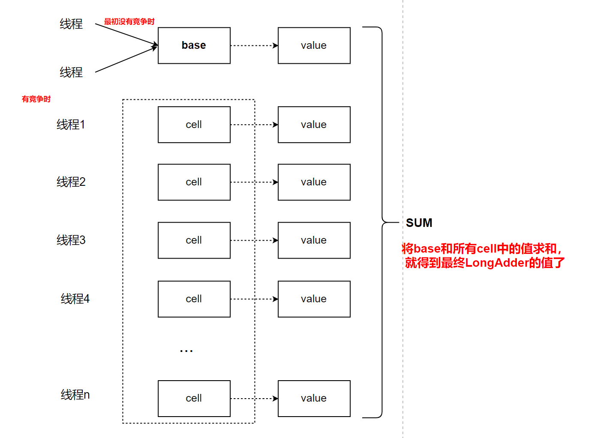

# 01 引言

```java
public class LongAdder extends Striped64 implements Serializable{}
// * @since 1.8
// * @author Doug Lea
```
* JDK8新提供的统计器类 —— LongAdder。
* 这个类是为了实现在高并发下实现高并发统计的类。


# 02 LongAdder为了解决什么问题设计的

* 在JDK1.8之前，可能会用AtomicLong这个原子变量类，在高并发下去统计一些数据。
* 在使用这个类去统计的时候会遇到一些问题，因为这个类的底层是基于CAS去实现的。

''' 举例如下：'''

* package java.util.concurrent.atomic.AtomicLong中的getAndIncrement()方法的声明：
```java
/**
 * Atomically increments by one the current value.  以原子的方式将当前值增加1
 *
 * @return the previous value  返回之前的值
 */
public final long getAndIncrement() {
    return unsafe.getAndAddLong(this, valueOffset, 1L);
}
```

* 进一步我们看看getAndAddLong()的实现方式，该方法在sun.misc.Unsafe类中，该方法在声明如下：
```java
public final long getAndAddLong(Object o, long offset, long delta) {
    long v;
    do {
        v = this.getLongVolatile(o, offset);    // 从主存中重新拉取值作为期望值
    } while(!this.compareAndSwapLong(o, offset, v, v + delta));  // 调用CAS方法，将参数都传递进去

    return v;
}
```

## 分析问题
    有了CAS的基础，我们知道AtomicLong，同时也知道AtomicReference的出现。
    // 我们知道，在上述代码的实现，
    // 在高并发的情况下，我们会遇到两个比较典型的问题：
    // 1.性能不高，因为在while(!this.compareAndSwapLong(o, offset, v, v + delta));会出现阻塞
    而且，每次只能有一个线程设置成功，只要设置成功那么期望值就改变了，所以，其他线程拿到的v就没用了，
    所以需要重新获取v的值。重新执行上述的流程。
    // 2.无法察觉ABA问题。

# 03 LongAdder的设计思想——化整为零

* （如图所示：img/01-思想图）
* 

    最初线程没有竞争的时候，一个一个来，我结束了，你来，你结束了，他来，没有冲突，交替着来，写到base中(CAS操作)。
    假设，有几个线程写入Base出现了冲突，返回了false。
    这个时候，就会创建一个cells 数组。cells数组中的cell单元存储的是value。
    这里需要注意的是，不是每个线程都向一个cell单元中写，而是通过位运算，都能算出一个hash值，来对应自己的cell单元。
    保证，每个线程写入的都是自己的cell单元。
    
    这些就导致，求和的时候，需要将base和所有cell单元中的value值加起来。这样才是总的sum.
    
    这种思路实际上就是，化整为零，空间换时间的做法。

# 04 LongAdder和AtomicLong的对比

* 在高并发下，这样能带来多大性能的提升呢？
* 在高并发下，原子类的能有多差的性能呢？
* LongAdderVSAtomicLongDemo : 对比上述两者的性能差别。

    从演示案例我们可以确定一点：LongAdder在高并发下的性能远优于AtomicLong。
    我们在演示案例中发现，两者对比的演示中，只有1出不同：
    LongAdder：longAdder.add(1);
    AtomicLong：atomicLong.incrementAndGet();
    
    那么:java.util.concurrent.atomic.LongAdder->add()怎么实现高并发下如此高的性能的？ —— 下面解释。