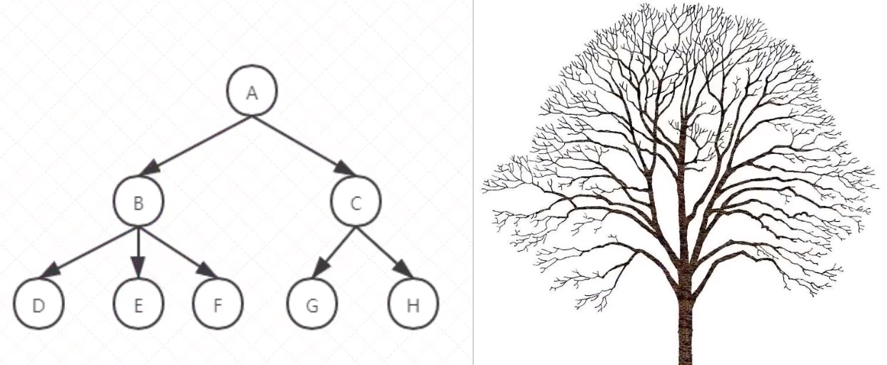
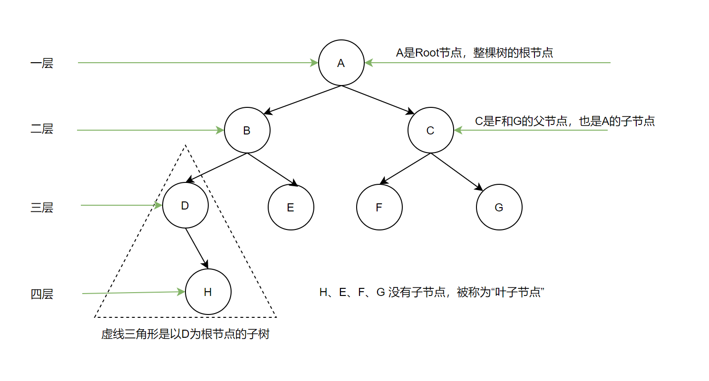
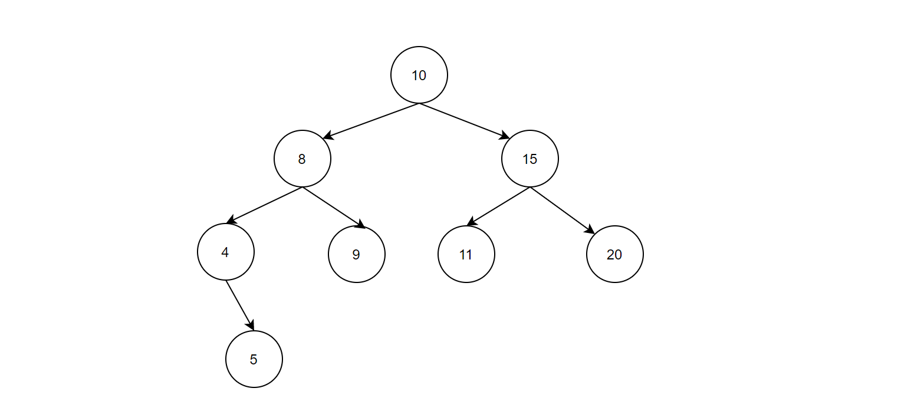
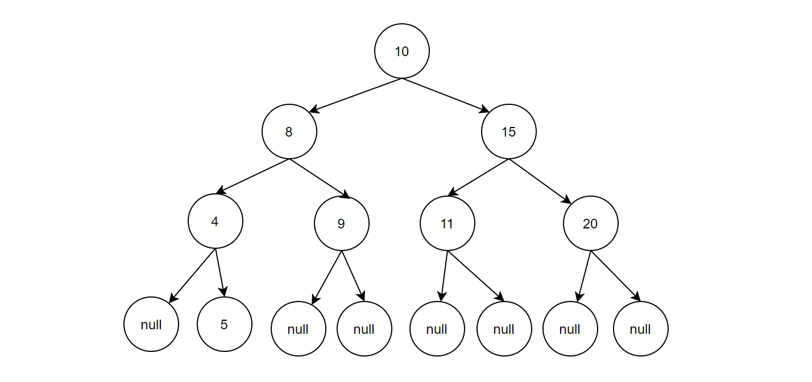

### 什么是树
    **树**（tree）是一种抽象数据类型（ADT），用来模拟具有树状结构性质的数据集合。
    它是由 n（n > 0）个有限节点通过连接它们的边组成一个具有层次关系的集合。
    把它叫做“树”是因为它看起来像一颗倒挂的树，也就说，它是根朝上，而叶朝下的。
    树有很多种，像下面的这样，一个节点有 > 2 个子节点的树，称为多路树，
    而每个节点最多只能有 2 个子节点的的树，称为二叉树。


    1. 节点：上图中的圆圈，比如A、B、C等都是表示节点。
    节点一般代表一些实体，在Java面向对象编程中，节点一般代表对象。
    2. 边：连接节点的线称为边，边表示节点与节点的关联关系。
    一般从一个节点到另一个节点的唯一方法就是顺着有边的道路前进。在Java当中通常表示引用。

### 树结构常用术语

```text
1.路径：顺着节点的边，从一个节点到另一个节点，所经过的节点，顺序排列就成为“路径”。
2.根：树顶端的节点称为根。一棵树只有一个根，如果要把一个节点和边的集合称为树，那么从根到其他任何一个节点都必须有且只有一条路径。
3.父节点：若一个节点含有子节点，则这个节点称为其子节点的父节点。
4.子节点：一个节点所含有的所有子树的节点，称为该节点的字节点。
5.兄弟节点：具有相同父节点的节点称为兄弟节点。
6.叶子节点：没有子节点的节点称为叶子节点，也叫做叶节点。
7.子树：每个节点都可以作为子树的根，它和它所有的子节点、子节点的子节点都包含在子树中。
8.节点的层次：从根开始定义，根为第一层，根的子节点为第二层，以此类推。
9.深度：对于任意节点N，N的深度为从根到N的唯一路径长，根的深度为0（从上往下看）。
10.高度：对于任意节点N，N的高度为从N到一片树叶的最长路径长，所有树叶的高度为0（从下往上看）。
```

### 二叉搜索树
**二叉树**：树的每个节点最多只能有两个子节点。二叉树的子节点称为“左子节点”和“右子节点”。<br/>

**二叉搜索树**：如果我们给二叉树加一个额外的条件，就可以得到一种被叫做“二叉搜索树”（binary search tree）的特殊二叉树。<br/>
二叉搜索树要求：
* 若它的左子树不空，则左子树上所有节点的值均小于它的根节点的值；
* 若它的右子树不空，则右子树上所有节点的值均大于它的根节点的值；
* 它的左、右子树也分别为二叉排序树。


**二叉搜索树-查找节点**：<br/>
查找某个节点，必须从根节点开始查找：

* 1. 查找值比当前节点值大，则搜索右子树；
  2. 查找值小于当前节点值，则搜索左子树；
  3. 重复1和2操作；
  4. 查找值等于当前节点值，停止搜索（终止条件）。

**二叉搜索树-插入节点**：<br/>
要插入节点，必须先找到插入的位置。<br/>
与查找操作相似，由于二叉搜索树的特殊性，<br>
待插入的节点也需要从根节点开始进行比较，<br/>
小于根节点则与根节点左子树比较，反之则与右子树比较，<br/>
直到左子树为空或右子树为空，则插入到相应为空的位置。


**二叉搜索树-遍历节点**

遍历树是根据一种特定的顺序访问树的每一个节点，比较常用的有前序遍历、中序遍历和后序遍历，而二叉搜索树最常用的是中序遍历。

二叉搜索树的中序遍历是有顺序的。

上图的二叉搜索树，按照中序遍历的顺序，相当于通过垂直线直接映射每个值，结果为：4，5，8，9，10，11，15，20。

- 中序遍历：左子树 —> 根节点 —> 右子树
- 前序遍历：根节点 —> 左子树 —> 右子树
- 后序遍历：左子树 —> 右子树 —> 根节点


**二叉搜索树-查找最大值和最小值**

要找最小值，先找根节点，然后一直找这个左节点的左节点，直到找到没有左节点的节点，那么这个节点就是最小值。
同理要找最大值，一直找根节点的右节点，直到找到没有右节点的节点，那么这个节点就是最大值。

上述操作的分析：由于二叉搜索树的中序遍历是有序的，那么最小值是中序遍历最左边的元素、最大值是中序遍历最右边的元素。


**二叉搜索树-删除节点**

删除节点是二叉搜索树中最复杂的操作，删除的节点有3种情况，前两种比较简单，但第三种却很复杂。

1. 该节点是叶子节点（没有子节点）
2. 该节点有一个子节点
3. 该节点有两个子节点

①. **删除没有子节点的节点**

要删除叶节点，只需要改变该节点的父节点引用。即，将该父节点引用改为null即可。


②.  删除有一个子节点的节点

删除有一个子节点的节点，只需要将其父节点原本指向该节点的引用，改为指向该节点的子节点即可。


二叉搜索树是有顺序的，对于任意的节点，该节点的左侧节点的值一定是小于根节点的值、根节点的右侧节点的值一定是大于根节点的值。所以删除一个只有一个子节点的节点，只需要将其父节点的指向改变为该节点的下一级子节点即可。

③. 删除有两个子节点的节点


当删除的节点存在两个子节点，那么删除之后，两个子节点的位置我们就没办法处理了。

既然处理不了，我们就想到一个办法，用另一个节点来代替被删除的节点，那么用哪个节点来替代呢？

提出“后继节点”的概念：属于该节点的子节点，并且大于该节点的最小节点，就是该节点的**后继节点**。

我们知道二叉搜索树的中序遍历是有大小关系的，某个节点的后继节点对应的就是该节点中序遍历排列的后一个节点。用后继节点来代替删除的节点，显然该二叉搜索树还是有序的。


**如何找到删除节点的中序后继节点呢？**

这实际上就是要找比删除节点关键值大的节点集合中最小的一个节点，只有这样代替删除节点，删除后才能满足二叉搜索树的特性。

④. **删除有必要吗？**

通过上面的讨论分类讨论，发现删除其实挺复杂的。其实，我们可以不用真正的删除该节点，只需要在Node类中增加一个表示字段delete，当该字段为true时，表示该节点已经删除。反之则没有删除，这样删除节点就不会改变树的结构了。

这样造成的影响就是，查询时需要判断一下节点是否已经被删除。（逻辑删除）

### 时间复杂度分析

**1. 回顾经典-二分查找算法**

有序数组：[1, 2, 3, 4, 5, ..., 100]
暴力算法：运气好时，性能不错；运气不好时，性能暴跌。
二分查找算法：数据源必须是有序数组，性能非常不错，每次迭代查询可以排除掉一半的结果。

```java
/**
 * 二分查找算法
 *
 * @param arr  有序数组
 * @param data 查找的数据
 * @return index 下标，未查找到时返回-1
 */
public static int binarySearch(int[] arr, int data) {
    int low = 0;
    int high = arr.length - 1;
    while (low <= high) {
        int mid = low + (high - low) / 2;
        if (arr[mid] < data) {
            low = mid + 1;
        } else if (arr[mid] == data) {
            return mid;
        } else {
            high = mid - 1;
        }
    }
    return -1;
}
```

**2. 二分查找算法最大的缺陷是什么？**

- 强制依赖有序数组，性能才能不错。

**3. 数组有什么缺陷？**

- 没有办法快速插入
- 没有办法动态扩容

**4. 怎么才能拥有二分查找的高性能，又能拥有链表一样的灵活性？**

- 二叉搜索树

**5. 二分查找算法时间复杂度推算过程**

| 第几次查询 | 剩余待查询元素数量 |
| :--------: | :----------------: |
|     1      |      N/(2^1)       |
|     3      |      N/(2^2)       |
|     3      |      N/(2^3)       |
|     K      |      N/(2^K)       |

从上表可以看出 **N/(2^K)** 肯定是大于等于1（有数据才能往后查），即 **N/(2^K)>=1**。我们计算时间复杂度是按照最坏的情况进行计算，也就是查到剩余最后一个数才查到我们想要的数据，也就是 N/(2^K)=1 => 2^K=N => **K = log2(N) => 二分查找算法时间复杂度：O(log2(N)) 或 O(logN)。**

### 普通二叉搜索树致命缺陷


**查找效率：**O(N)

**如何解决二叉搜索树退化成线性链表的问题？**

如果插入元素时，树可以自动调整两边平衡，这时会保持不错的查找性能。

### AVL树简介

**AVL树有什么特点？**

1. 具有二叉查找树的全部特性；
2. 每个节点的左子树和右子树的高度差至多等于1


平衡树基于这种特点就可以保证不会出现大量节点偏向一边的情况了。（插入或者删除时，会发生左旋、右旋操作，使这棵树再次左右保持一定的平衡）

如何构建AVL树等知识此处不做叙述。

**为什么有了平衡树还需要红黑树？**

虽然平衡树解决了二叉查找树退化为近似链表的缺点，能够把查找时间控制在O(logN)，不过却不是最佳的。

因为平衡树要求每个节点的左子树和右子树的高度差至多等于1，这个要求实在太严格了，导致每次进行插入/删除节点的时候，几乎都会破坏平衡树的第二个规则，进而我们都需要通过左旋和右旋来进行调整，这会使平衡树的性能大打折扣

为了解决上述这个问题，于是有了红黑树。