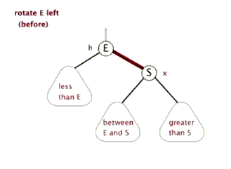
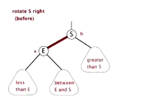

## 红黑树


###  红黑树的性质


1. 每个节点要么是黑色，要么是红色。
   `(除了黑色还可以是其他颜色吗?可以！只要清楚是什么意义就行了)`

2. 根节点是**黑色**。※

3. 每个叶子节点（NIL）是**黑色**。
   `(NIL节点是虚拟存在的，也就是空节点)`

4. 每个红色节点的两个子节点一定都是**黑色**。不能有两个红色节点相连。

5. 任意一节点到每个叶子节点的路径都包含数量相同的黑节点。俗称“**黑高**”。 
   `性质5的推论——`

    `5.1：如果一个节点存在黑子节点，那么该节点肯定有两个子节点 ` 


红黑树并不是一个完美平衡二叉查找树，从图上可以看到，根节点P的左子树显然比右子树高。

但左子树和右子树的黑节点的层数是相等的，也即任意一个节点到每个叶子节点的路径都包含数量相等的黑节点（性质5）.

所以我们叫红黑树这种平衡为**黑色完美平衡**。

**只要这棵树满足以上性质，这棵树就是趋近于平衡状态的。发明红黑树的科学家就是如此大牛！**

```java
我们将重点放在以上性质发生变化时，如何处理。
而不是红黑树为什么这样定义。
```

### 平衡手段

红黑树能自平衡，依靠的是三种操作：**左旋、右旋和变色。**

1. **变色**：节点的颜色由红变黑或由黑变红。
2. **左旋**：以某个节点作为支点(旋转节点)，记作A。
   - 旋转节点A的右子节点，记作B。
     B左旋变为旋转节点A的父节点。
   - 右子节点B的左子节点，记作C。
     C变为旋转节点A的右子节点。
   - 旋转节点A的左子节点，记作D。
     D保持不变。
     
3. **右旋**：以某个节点作为支点(旋转节点)，记作A。
   - 旋转节点A的左子节点，记作B。
     B右旋变为旋转节点A的父节点。
   - 左子节点B的右子节点，记作C。
     C变为旋转节点A的左子节点。
   - 旋转节点A的右子节点，记作D。
     D保持不变。
     

 **左旋图示**


**右旋图示**


### 红黑树的查找


红黑树查找和普通的二叉搜索树没什么区别。只是红黑树在插入的时候会自平衡，让整棵树看起来是趋近于平衡状态的。查找效率会一直保持在一个不错的区间。

### 红黑树的插入

插入操作包括两部分工作：

1. 查找插入的位置
2. 插入后自平衡

**注意**：插入节点，必须为<font color="red">红色</font>。
**理由**：

- 红色节点的父节点（如果存在）必为黑色节点时，插入红色节点时，红黑树的黑色平衡没被破坏，不需要做自平衡。
- 但如果插入节点是黑色，那么插入位置所在的子树黑色节点总是多1，必须做自平衡。

**插入红色节点21情况**


自平衡。

**插入黑色节点21情况**


破坏自平衡。

**插入红色节点88情况**


破坏红黑树的性质。

**综上所述**：插入一定插入的是红色节点，而不是黑色节点；插入红色节点可能自平衡，也可能破坏红黑树的性质。

---

### 插入节点情景分析

**约定**：


#### **情景1：红黑树为空树**

最简单的一种请将，直接把插入节点作为根节点就行
注意：根据红黑树的性质2：根节点是黑色。还需要把插入节点设为黑色。

#### **情景2：插入节点的Key存在**

处理：更新当前节点的值，为插入节点的值。


#### **情景3：插入节点的父节点为黑色节点**

由于插入的节点是红色的，当插入节点是黑色时，并不会影响红黑树的平衡，直接插入即可，无需做自平衡。


#### **情景4：插入节点的父节点为红色**

再次回想下红黑树的**性质2：根节点是黑色。**如果插入节点的父节点为<font color="red">红色节点</font>，那么该父节点不可能是根节点。由此可知，插入节点总是存在爷爷节点。

这一点很关键，因为后续的旋转操作肯定需要祖父节点的参与。


##### **情景4-1：叔叔节点存在并且为红色节点**

依据红黑树的**性质4可知，红色节点不能相连，由此可知爷爷节点肯定为黑色节点。**

因为不可以同时存在两个相连的红色节点。那么此时该插入字数的红黑层数情况是：黑-红-红。显然最简单的处理方式是把其改为红-黑-红。

**处理：**

1. 将P和U节点改为黑色
2. 将PP改为红色
3. 将PP设置为当前，进行后续处理。


可以看到，将PP节点设为红色了，如果PP节点的父节点是黑色，那么无需再做任何处理；

但如果PP的父节点是红色，则违反红黑树性质了，所以需要将PP设置为当前节点，继续做插入操作自平衡处理，直到平衡为止。

##### **情景4-2：叔叔节点不存在或为黑色节点，并且插入节点的父亲节点是爷爷节点的左子节点**

**注意：单纯从插入前来看，叔叔节点非红即空(NIL节点)，否则的话破坏了红黑树性质5，此路径会比其它路径多一个黑色节点。**


###### **情景4-2-1：新插入节点，为其父节点的左子节点（LL红色情况）**


**处理：**

1. 变颜色：将P设置为黑色，将PP设置为红色
2. 对PP节点进行右旋


###### **情景4-2-2：新插入节点，为其父节点的右子节点（LR红色情况）**


**处理：**

1. 对P进行左旋
2. 将P设置为当前节点，得到LL红色情况
3. 按照LL红色情况处理：
   1. 变颜色
   2. 右旋PP


##### **情景4-3：叔叔节点不存在或为黑色节点，并且插入节点的父节点是爷爷节点的右子节点**

该情景对应情景4-2，只是方向反转。


###### **情景4-3-1：新插入节点，为其父节点的右子节点（RR红色情况）**


**处理：**

1. 变颜色：将P设置为黑色，将PP设置为红色
2. 对PP节点进行左旋


###### **情景4-3-2：新插入节点，为其父节点的左子节点（RL双红）**


**处理：**

1. 对P进行右旋
2. 将P设置为当前节点，得到RR红色情况
3. 按照RR红色情况处理：
   1. 变颜色
   2. 左旋PP


### 插入应用

**已知一颗平衡二叉树**


#### 插入红色节点7

