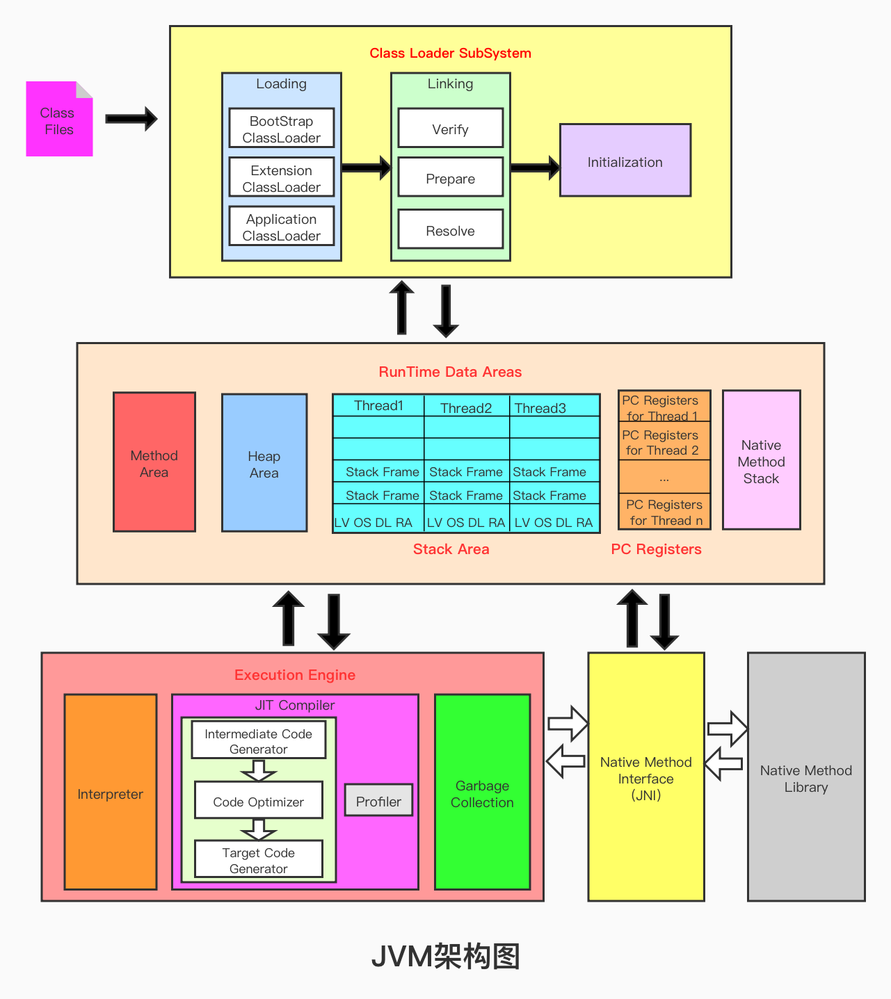
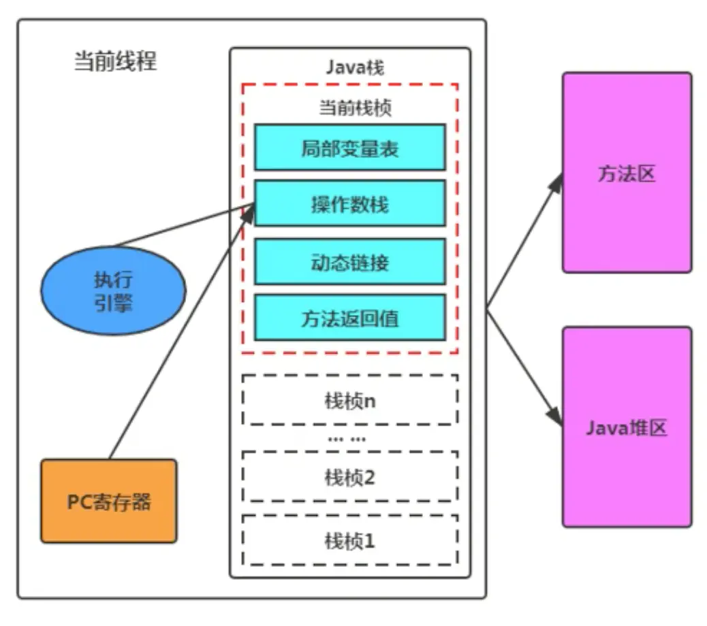
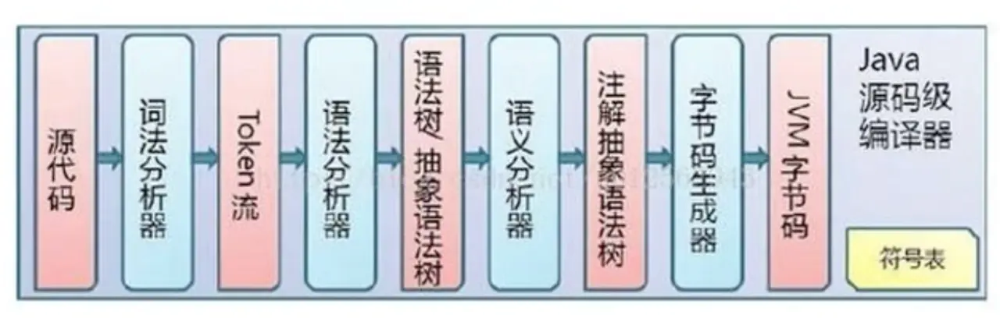
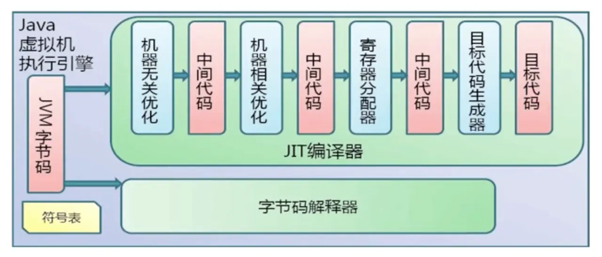
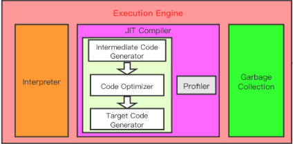
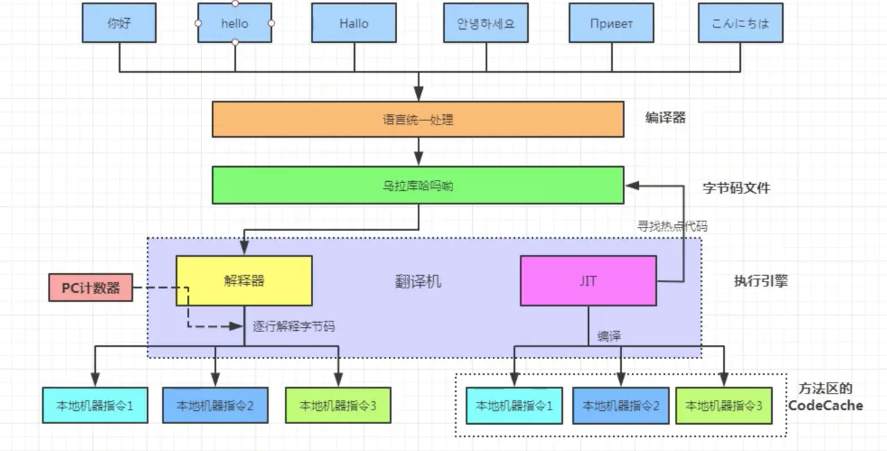
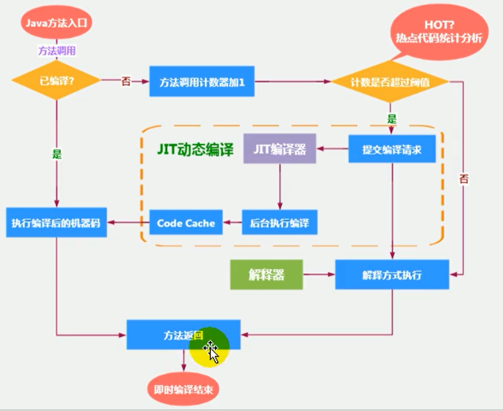
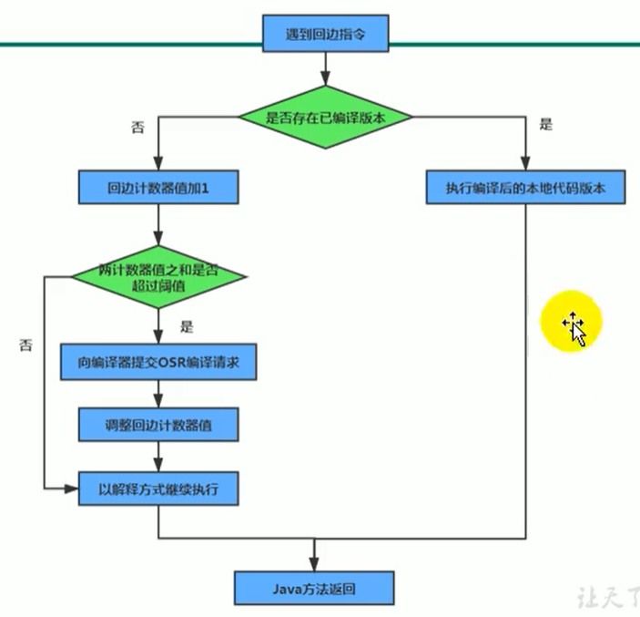
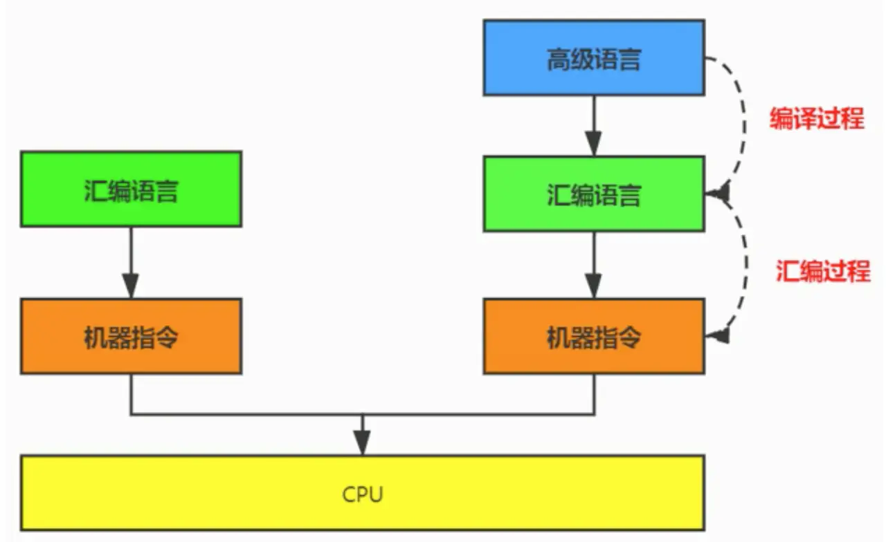

本博客是纯属个人学习，多数资料是从网上或其他地方引用，若有版权冲突，请及时与本人联系。有众多不便，请谅解。
转载于:https://www.cnblogs.com/yanl55555/p/13334713.html

## JVM执行引擎简介

```apl
1 执行引擎是Java虚拟机的核心组成部分之一

2 虚拟机是一个相对于“物理机”的概念，这两种机器都有代码执行能力， 
其区别是物理机的执行引擎
是直接建立在处理器、缓存、指令集和操作系统层面上的。
而虚拟机的执行引擎则是由软件自行实现的，
因此可以不受物理条件制约地定制指令集与执行引擎的结构体系，
能够执行那些不被硬件直接支持的指令集格式。

3 JVM的主要任务是负责装载字节码到其内部，
但字节码并不能够直接运行在操作系统之上，
因为字节码指令并非等价于本地机器指令，
它内部包含的仅仅只是一些能够被JVM所识别的字节码指令、
符号表和其他辅助信息

4 那么，如果想让一个Java程序运行起来、
执行引擎的任务就是，
将字节码指令解释/编译为对应平台上的本地机器指令。
简单来说，JVM中的执行引擎充当了将高级语言翻译为机器语言的译者.
```

### **JVM架构图**

> 

### 执行引擎的部分工作流程

```apl
1 从外观上来看，
所有的Java虚拟机的执行引擎输入、输出都是一致的：
    - 输入的是字节码二进制流，
    - 处理过程是字节码解析执行的等效过程，
    - 输出的是执行结果。

2 执行引擎在执行的过程中，
究竟需要执行什么样的字节码指令，
完全依赖于PC寄存器。
每当执行完一项指令操作后，
PC寄存器就会更新下一条需要被执行的指令地址。

3 方法在执行的过程中，
执行引擎有可以通过存储在局部变量表（栈）中的对象引用，
准确定位到存储在Java堆区中的对象实例信息。

4 可以通过对象头（堆）中的元数据指针，
定位到目标对象的类型信息（方法区）。
（下图堆区与方法区之间，其实还存在类型指针：
从堆区对象实例指向方法区的类元数据InstanceClass）
```

### **执行引擎的部分工作流程图**

> 

## Java代码编译和执行过程

> **Java代码编译是由Java源码编译器（Java前端编译器）来完成(与JVM无关)，流程图如下所示：**


> **Java字节码的执行是由JVM执行引擎来完成，流程图如下所示：**


## 为什么说Java是半解释半编译型语言？

> **JDK1.0时代：**
将Java语言定位为“解释执行”还是比较准确的
（先编译成字节码，再对字节码逐行解释执行interpreter）。
>
> **再后来：**
Java也发展出可以直接生成本地代码的编译器
（这里指的是后端编译器JIT，将源代码直接编译成和本地机器平台相关的机器语言）。

### 目前JVM执行引擎当中解释器与即时编译器共存

> 现在JVM在执行Java代码的时候，
会将解释执行与编译执行二者结合起来进行。
**如今Java采用的是解释和编译混合的模式：**
>

> 执行引擎获取到，由javac将源码编译成字节码文件class.之后，
然后在运行的时候通过解释器interpreter转换成最终的机器码。（解释型）
另外JVM平台支持一种叫作即时编译的技术。
即时编译的目的是避免函数被解释执行，而是将整个函数体编译成为机器码，
这种方式可以使执行效率大幅度提升（直接编译型）
>**具体解释和编译执行的过程**


#### 解释器（interpreter）

> 当Java虚拟机启动时会根据预定义的规范对字节码采用逐行解释的方式执行，
将每条字节码文件中的内容“翻译”为对应平台的本地机器指令执行。
>
> 解释器真正意义上所承担的角色就是一个运行时“翻译者”，
将字节码文件中的内容“翻译”为对应平台的本地机器指令执行。
当一条字节码指令被解释执行完成后，
接着再根据PC寄存器中记录的下一条需要被执行的字节码指令执行解释操作。
在HotSpot VM中，解释器主要由Interpreter模块和Code模块构成。
>
> Interpreter模块：实现了解释器的核心功能
Code模块：用于管理HotSpot VM在运行时生成的本地机器指令

#### 即时编译器（JIT Just In Time Compiler）

> 由于解释器在设计和实现上非常简单，
因此除了Java语言之外，
还有许多高级语言同样也是基于解释器执行的，比如Python、 Perl、Ruby等。
但是在今天，基于解释器执行已经沦落为低效的代名词，
并且时常被一些C/C+ +程序员所调侃。
>
> 为了解决这个问题，JVM平台支持一种叫作即时编译的技术。
即时编译的目的是避免函数被解释执行，
而是将整个函数体编译成为机器码，
每次函数执行时，只执行编译后的机器码即可，这种方式可以使执行效率大幅度提升。
不过无论如何，基于解释器的执行模式仍然为中间语言的发展做出了不可磨灭的贡献。

## 热点代码及探测方式

```apl
是否需要启动JIT编译器 —— 将字节码直接编译为对应平台的本地机器指令，
需要根据代码被调用执行的频率而定。
关于那些需要被编译为本地代码的字节码，也被称之为“热点代码”。
JIT编译器在运行时会针对那些频繁被调用的“热点代码”做出深度优化，
将其直接编译为对应平台的本地机器指令，以此提升Java程序的执行性能。

一个被多次调用的方法或、一个方法体内部循环次数较多的循环体都可以被称之为“热点代码”，
因此都可以通过JIT编译器编译为本地机器指令。
由于这种编译方式发生在方法的执行过程中，
因此也被称之为栈上替换，或简称为OSR （On StackReplacement）编译。

一个方法究竟要被调用多少次，或者一个循环体究竟需要执行多少次循环才可以达到这个标准？
必然需要一个明确的阈值，
这样JIT编译器才会将这些“热点代码”编译为本地机器指令执行。
这里主要依靠 热点探测功能。

目前HotSpot VM所采用的热点探测方式是基于计数器的热点探测。

采用基于计数器的热点探测，
HotSpot VM将会为每一个方法都建立2个不同类型的计数器，
分别为方法调用计数器（Invocation Counter） 和回边计数器（BackEdge Counter） 。
        - 方法调用计数器用于统计方法的调用次数。
        - 回边计数器则用于统计循环体执行的循环次数。
```

### 方法调用计数

> 这个计数器用于：统计方法被调用的次数，
> 它的默认阈值在Client 模式下是1500 次，在Server 模式下是10000次。
> 超过这个阈值，就会触发JIT编译。
> 这个阈值可以通过虚拟机参数 `-XX ：CompileThreshold` 来人为设定。
>
> - 当一个方法被调用时， 会先检查该方法是否存在被JIT编译过的版本，
> - 如果存在，则优先使用编译后的本地代码来执行。
> - 如果不存在已被编译过的版本，则将此方法的调用计数器值加1，
> - 然后判断方法调用计数器与回边计数器值之和是否超过方法调用计数器的阈值。
> - 如果已超过阈值，那么将会向即时编译器提交一个该方法的代码编译请求。
>
> 
> 注意：热频代码片段经过即时编译后的产物--机器指令，
> 需要缓存起来Code Cache，存放在方法区（元空间/本地内存）

### 热度衰减

>**如果不做任何设置，**
>**方法调用计数器统计的并不是方法被调用的绝对次数，**
>**而是一个相对的执行频率，**
>**即一段时间之内方法被调用的次数。**

>当超过一定的时间限度， 
如果方法的调用次数仍然不足以让它提交给即时编译器编译，
那这个方法的调用计数器就会被减少一半，
这个过程称为方法调用计数器热度的衰减（Counter Decay），
而这段时间就称为此方法统计的半衰周期（Counter Half Life Time）。

>进行热度衰减的动作是在虚拟机进行垃圾收集时顺便进行的，
可以使用虚拟机参数  `-XX：-UseCounterDecay` 来关闭热度衰减，
让方法计数器统计方法调用的绝对次数，
这样，只要系统运行时间足够长，绝大部分方法都会被编译成本地代码。
另外， 可以使用 `-XX：CounterHalfLifeTime` 参数设置半衰周期的时间，单位是秒。

### 回边计数器

>它的作用是统计一个方法中循环体代码执行的次数，
在字节码中遇到控制流向后跳转的指令称为“回边” （Back Edge）。
显然，建立回边计数器统计的目的就是为了触发OSR编译。


## 解释器依然存在的必要性

> 有些开发人员会感觉到诧异，既然HotSpotVM中已经内置JIT编译器了，
那么为什么还需要再使用解释器来“拖累”程序的执行性能呢？
比如JRockit VM内部就不包含解释器，字节码全部都依靠即时编译器编译后执行。

>**首先明确**：
>当程序启动后，解释器可以马上发挥作用，省去编译的时间，立即执行。 
编译器要想发挥作用，把代码编译成本地代码，需要一定的执行时间。
但编译为本地代码后，执行效率高。
>
>**所以**：
尽管JRockitVM中程序的执行性能会非常高效，
但程序在启动时必然需要花费更长的时间来进行编译。
对于服务端应用来说，启动时间并非是关注重点，
但对于那些看中启动时间的应用场景而言，
或许就需要采用解释器与即时编译器并存的架构来换取一一个平衡点。
在此模式下，当Java虚拟器启动时，解释器可以首先发挥作用，
而不必等待即时编译器全部编译完成后再执行，这样可以省去许多不必要的编译时间。
随着时间的推移，编译器发挥作用，把越来越多的代码编译成本地代码，获得更高的执行效率。
>
>同时，解释执行在编译器进行激进优化不成立的时候，作为编译器的“逃生门”。

### HostSpot JVM的执行方式

>当虛拟机启动的时候，解释器可以首先发挥作用，
而不必等待即时编译器全部编译完成再执行，这样可以省去许多不必要的编译时间。
并且随着程序运行时间的推移，即时编译器逐渐发挥作用，
根据热点探测功能，将有价值的字节码编译为本地机器指令，以换取更高的程序执行效率。

### HotSpot VM 可以设置程序执行方式

>缺省情况下HotSpot VM是采用解释器与即时编译器并存的架构，
当然开发人员可以根据具体的应用场景，通过命令显式地为Java虚拟机指定在运行时到底是完全采用解释器执行，
还是完全采用即时编译器执行。如下所示：
    
    - `-Xint`： 完全采用解释器模式执行程序；
    - `-Xcomp`： 完全采用即时编译器模式执行程序。如果即时编译出现问题，解释器会介入执行。
- `-Xmixed`：采用解释器+即时编译器的混合模式共同执行程序。
```apl
测试表明：
纯解释器模式速度最慢（JVM1.0版本用的就是纯解释器执行）
混合模式速度更快
```

```java
/**
 * 测试解释器模式和JIT编译模式
 *  -Xint  : 6520ms
 *  -Xcomp : 950ms
 *  -Xmixed : 936ms
 */
public class IntCompTest {
    public static void main(String[] args) {
        long start = System.currentTimeMillis();
        testPrimeNumber(1000000);
        long end = System.currentTimeMillis();
        System.out.println("花费的时间为：" + (end - start));
    }

    public static void testPrimeNumber(int count){
        for (int i = 0; i < count; i++) {
            //计算100以内的质数
            label:for(int j = 2;j <= 100;j++){
                for(int k = 2;k <= Math.sqrt(j);k++){
                    if(j % k == 0){
                        continue label;
                    }
                }
                //System.out.println(j);
            }

        }
    }
}
```

### 宕机案例，热机状态切换

```apl
注意解释执行与编译执行在线上环境微妙的辩证关系。
机器在热机状态可以承受的负载要大于冷机状态。
如果以热机状态时的流量进行切流，可能使处于冷机状态的服务器因无法承载流量而假死。

在生产环境发布过程中，以分批的方式进行发布，根据机器数量划分成多个批次，
每个批次的机器数至多占到整个集群的 1/8。
曾经有这样的故障案例：
	某程序员在发布平台进行分批发布，在输入发布总批数时，
	误填写成分为两批发布。
	如果是热机状态，在正常情况下一半的机器可以勉强承载流量，
	但由于刚启动的JVM均是解释执行，还没有进行热点代码统计和JIT动态编译，
	导致机器启动之后，当前 1/2 发布成功的服务器马上全部宕机，
	此故障说明了JIT的存在。一阿里团队
```

## 机器码、指令、汇编语言

### 机器码

>各种用二进制编码方式表示的指令（010101........），叫做机器指令码。
>开始，人们就用它采编写程序，这就是机器语言。
>机器语言虽然能够被计算机理解和接受，但和人们的语言差别太大，
>不易被人们理解和记忆，并且用它编程容易出差错。
>用它编写的程序一经输入计算机，CPU直接读取运行，因此和其他语言编的程序相比，执行速度最快。
>机器指令与CPU紧密相关，所以不同种类的CPU所对应的机器指令也就不同。

### 指令

>由于机器码是有0和1组成的二进制序列，可读性实在太差，于是人们发明了指令。
指令就是把机器码中特定的0和1序列，简化成对应的指令（一般为英文简写，如mov，inc等），可读性稍好
由于不同的硬件平台，执行同一个操作，对应的机器码可能不同，所以不同的硬件平台的同一种指令（比如mov），对应的机器码也可能不同。

### 指令集

>不同的硬件平台，各自支持的指令，是有差别的。
因此每个平台所支持的指令，称之为对应平台的指令集。
如常见的:
    x86指令集，对应的是x86架构的平台
    ARM指令集，对应的是ARM架构的平台

### 汇编语言

>由于指令的可读性还是太差，于是人们又发明了汇编语言。
在汇编语言中，用助记符（Mnemonics）代替机器指令的操作码，
用地址符号（Symbol）或标号（Label）代替指令或操作数的地址。
在不同的硬件平台，汇编语言对应着不同的机器语言指令集，通过汇编过程转换成机器指令。
由于计算机只认识指令码，所以用汇编语言编写的程序还必须翻译成机器指令码，计算机才能识别和执行。

### 高级语言

>为了使计算机用户编程序更容易些，后来就出现了各种高级计算机语言。高级语言比机器语言、汇编语言更接近人的语言
当计算机执行高级语言编写的程序时，仍然需要把程序解释和编译成机器的指令码。完成这个过程的程序就叫做解释程序或编译程序。



## 补充几种编译器

```
1.前端编译器：把.java文件转变成.class文件。
包括Sun的Javac、Eclipse JDT中的增量式编辑器（ECJ）

2.后端运行期即时编译器（JIT编译器，Just In Time Compiler）：把字节码转成机器码。
包括HotSpot VM的C1、C2编译器

3.静态提前编译器（AOT编译器，Ahead Of Time Compiler）：把*.java编译成本地机器码。
包括GNU Compiler for the Java（GCJ）、Excelsior JET
```

本篇内容重点强调第二种，也就是我们的JIT。

### HotSpot VM 中的JIT分类

>在HotSpot VM中内嵌有两个JIT编译器，分别为Client Compiler和Server Compiler，
但大多数情况下我们简称为C1编译器和C2编译器。
开发人员可以通过如下命令显式指定Java虚拟机在运行时到底使用哪一种即时编译器，如下所示：
>
>-   `-client`： 指定Java虚拟机运行在Client模式下，并使用C1编译器；
          C1编译器会对字节码进行简单和可靠的优化，耗时短。以达到更快的编译速度。
-   `-server`： 指定Java虚拟机运行在Server模式下，并使用C2编译器。
          C2进行耗时较长的优化，以及激进优化。但优化的代码执行效率更高。
>
>注意：64位操作系统默认使用-server服务器模式，即C2编译器。

### C1和C2编译器不同的优化策略

>在不同的编译器上有不同的优化策略，C1编译器上主要有方法内联，去虚拟化、冗余消除。
    **a.方法内联：将引用的函数代码编译到引用点处，**
       **这样可以减少栈帧的生成，减少参数传递以及跳转过程**
    **b.去虚拟化：对唯一的实现类进行内联**
>**c.冗余消除：在运行期间把一些不会执行的代码折叠掉**
>
C2的优化主要是在全局层面，逃逸分析是优化的基础。基于逃逸分析在C2.上有如下几种优化：
    （server模式下才会有这些优化，64位系统默认就是server模式）
    **a.标量替换：用标量值代替聚合对象的属性值**
    **b.栈上分配：对于未逃逸的对象分配对象在栈而不是堆**
    **c.同步消除：清除同步操作，通常指synchronized**

>
>C2编译器启动时长比C1编译器慢，系统稳定执行以后，C2编译器执行速度远远快于C1编译器。
>
>程序解释执行（不开启性能监控）可以触发C1编译，将字节码编译成机器码，可以进行简单优化，也可以加上性能监控，
C2编译会根据性能监控信息进行激进优化。
>
>不过在Java7版本之后，一旦开发人员在程序中显式指定命令“-server"时，
默认将会开启分层编译策略，由C1编译器和C2编译器相互协作共同来执行编译任务。

### Graal编译器

>**自JDK10起，HotSpot又加入一个全新的即时编译器： `Graal编译器`**
>编译效果短短几年时间就追评了C2编译器。未来可期。
>目前，带着“实验状态"标签，需要使用开关参数 
>`-XX： +UnlockExperimentalVMOptions 一XX： +UseJVMCICompiler`去激活，才可以使用。

### AOT编译器

>**jdk9引入了AOT编译器（静态提前编译器，Ahead Of Time Compiler）**
>Java 9引入了实验性AOT编译工具`jaotc`。它借助了`Graal` 编译器，
>将所输入的Java 类文件转换为机器码，并存放至生成的动态共享库之中。
>
>所谓AOT编译，是与即时编译相对立的一个概念。
>我们知道，即时编译指的是在程序的运行过程中，
>将字节码转换为可在硬件上直接运行的机器码，并部署至托管环境中的过程。
>而AOT编译指的则是，在程序运行之前，便将字节码转换为机器码的过程。
>**最大好处：** 
>	Java虚拟机加载已经预编译成二进制库，可以直接执行。
>	不必等待即时编译器的预热，减少Java应用给人带来“第一次运行慢”的不良体验。
>**缺点：**
>	破坏了java"一次编译，到处运行”（提前干掉了能够跨平台的class文件），
>必须为每个不同硬件、OS编译对应的发行包。
>	降低了Java链接过程的动态性，加载的代码在编译期就必须全部已知。
>还需要继续优化中，最初只支持Linux x64 java base