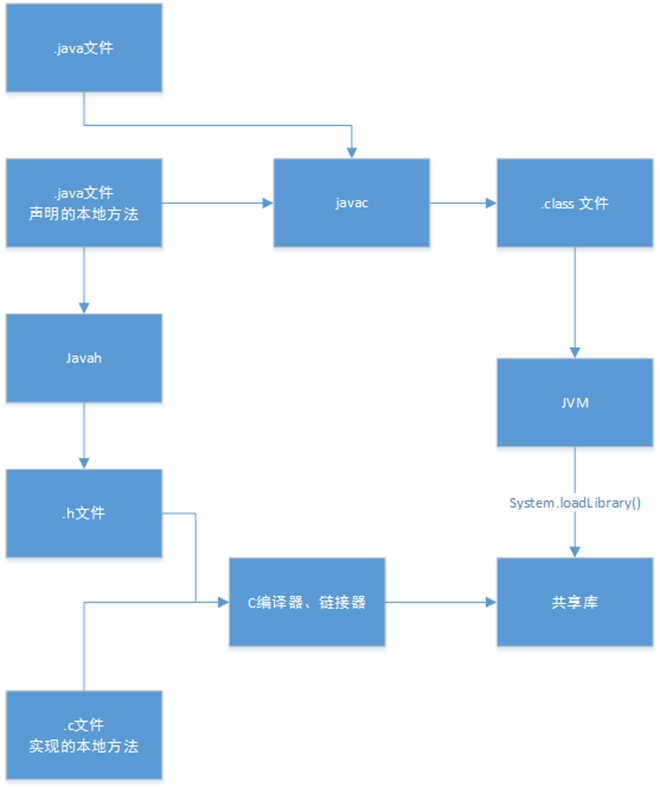

引出：

    我们都知道java.lang.Object源码中的方法，
    其中有一个声明如下：
    public native int hashCode();

**为什么有native呢？**
其实 native 就是 JNI（Java Native Interface:Java本地接口）。
其作用在于，满足用户和本地C语言代码进行相互操作提供API支持。

下面的案例来自：博客园，博主“我是修电脑的”
链接：https://www.cnblogs.com/KingIceMou/p/7239668.html

示例：**Java调用C的HelloWorld**
1. 创建一个Java类，里面包含着一个 native 的方法和加载库的方法 loadLibrary。
代码如下：
```java
public class HelloJni {
    static {
        System.loadLibrary("HelloJni");
    }
    public static native void sayHello();

    /**
     * @SuppressWarnings("static-access") 禁止与来自内部类的未优化访问相关的警告
     * 通缩说就是：有警告的地方用的是类对象而不是类本身，该注解将这个警告忽略
     * 这里就是，禁止main方法重通过类实例访问静态成员的警告的显示。
     * @param args
     */
    @SuppressWarnings("static-access")
    public static void main(String[] args) {
        new HelloWorld().sayHello();
    }
}
```
首先，注意native方法，native关键字告诉编译器（JVM），调用的方法是外部定义的(即C语言代码)。
我们直接运行一下(如下异常信息)：
```
java.lang.UnsatisfiedLinkError: no HelloJni in java.library.path
	at java.lang.ClassLoader.loadLibrary(ClassLoader.java:1867)
	at java.lang.Runtime.loadLibrary0(Runtime.java:870)
	at java.lang.System.loadLibrary(System.java:1122)
	at c_jni.HelloJni.<clinit>(HelloJni.java:9)
Exception in thread "main" 

接下来我们按照这个流程去执行演示native方法的调用：
１、在Java中声明native()方法并编译；
２、用javah产生一个.h文件；
３、写一个.c文件实现native导出方法，其中需要包含第二步产生的.h文件
    （注意其中又包含了JDK带的jni.h文件）；
４、将第三步的.c文件编译成动态链接库文件；
５、在Java中用System.loadLibrary()方法，
    加载第四步产生的动态链接库文件，这个native()方法就可以在Java中被访问了。
```

第1步：编译Java文件
```
cd 进入Java文件所在目录，执行：javac HelloJni.java
```


第2步：用javah产生一个.h文件
```
javah命令主要用于在JNI开发的时，
把java代码声明的JNI方法转化成C\C++头文件，
以便进行JNI的C\C++端程序的开发。 

对于Java的JNI要想生成C\C++头文件的话，
我一般的做法：
1. 先写个纯的java代码来进行JNI定义，
2. 接着用JDK编译，产生.class文件，
    D:\source-analysis\01-CAS原理实战\src\c_jni>javac HelloJni.java
    没有出错的话，会在该Java文件所在目录下生成一个HelloJni.class文件。
(上述两步，在第一步的时候就已经完成了。)

3. 然后再用javah命令生成JNI的C\C++头文件。
当然也可以不用javah命令，直接手写JNI的C\C++头文件。
    生成.h头文件的步骤：
    HelloWorld.java所在路径：
        D:\source-analysis\01-CAS原理实战\src\c_jni\HelloJni.java

    3.1 cd到资源的根目录，这里是：D:\source-analysis\01-CAS原理实战\src
        注意：一定是根目录：src, 而且下面classpath的配置是必须的，因为java只认classpath，而不认当前文件夹
        执行：set classpath=D:\source-analysis\01-CAS原理实战\src\c_jni 回车
        
    3.2 再执行：javah c_jni.HelloJni 回车
        注意：此时是在资源根目录下的class文件的位置
        执行之后，生成.h文件在同级目录下

    3.3 生成的.h文件名的命名规则是：包名的点都变成下划线了，
        所以这里生成的是：c_jni_HelloJni.h
        接受不了名字，重命名即可。

【说明】jni.h在%JAVA_HOME%\include文件夹下。
```


第3步：根据头文件中的声明，用C语言的实现方法
```
#include "c_jni_HelloJni.h"
#include <stdio.h>

JNIEXPORT void JNICALL Java_c_1jni_HelloJni_sayHello (JNIEnv *env, jclass jc) {
    printf("HelloJni");
}
```


第4步，生成dll共享库，然后Java程序load库，调用即可。
    首先说下DLL文件，DLL(Dynamic Link Library)文件为动态链接库件又称“应用程序拓展”，
    是软件文件类型。在Windows中，许多应用程序并不是一个完整的可执行文件，
    它们被分割成一些相对独立的动态链接库，即DLL文件，放置于系统中。
    当我们执行某一个程序时，相应的DLL文件就会被调用。
    一个应用程序可使用多个DLL文件，一个DLL文件也可能被不同的应用程序使用，
    这样的DLL文件被称为共享DLL文件。

```
注意，在Windows下是没有gcc命令的，需要下载：MinGW GCC
相当于是下载了一个gcc命令，用gcc生成dll文件命令如下：
gcc -m32  -Wl,--add-stdcall-alias -I"C:\Program Files\Java\jdk1.8.0_202\include" -I"C:\Program Files\Java\jdk1.8.0_202\include\include\win32" -shared -o HelloJni.dll HelloJni.c
参数说明： -I <dir>  的意思是HelloJni.c中使用#include<jni.h>,
gcc默认目录是"/usr/include"，
如果使用#include<jni.h>则找不到jni.h文件，
因此要通过“-I <dir>”参数来指定包含的头文件jni.h的位置。
还要注意，jni.h引用了jni_md.h，所以需要将jni_md.h粘贴到，与jni.h相同的路径下，这样才能编译成功。
```


第5步，配置java.library.path
    Java有两个Path，
    一个是classpath，另外一个library.path。
    classpath设置JDK的lib位置。
    library.path设置引用的非Java类包（如DLL，SO）的位置。
```
java.library.path
1.动态库所在位置，在windows中是dll文件，在linux中是so文件，
不是jar包路径
输出所有动态库所在路径（不止是java的）：
    System.out.println(System.getProperty('java.library.path'));
将dll文件粘贴到这些路径下即可，Java运行，会从这些路径去找动态库。

2.手动给出路径：
-Djava.library.path=动态库文件路径 
（通过Edit Configuration... -> VM options  去配置）
```


**最后补充：JNI调用C流程图**





END。